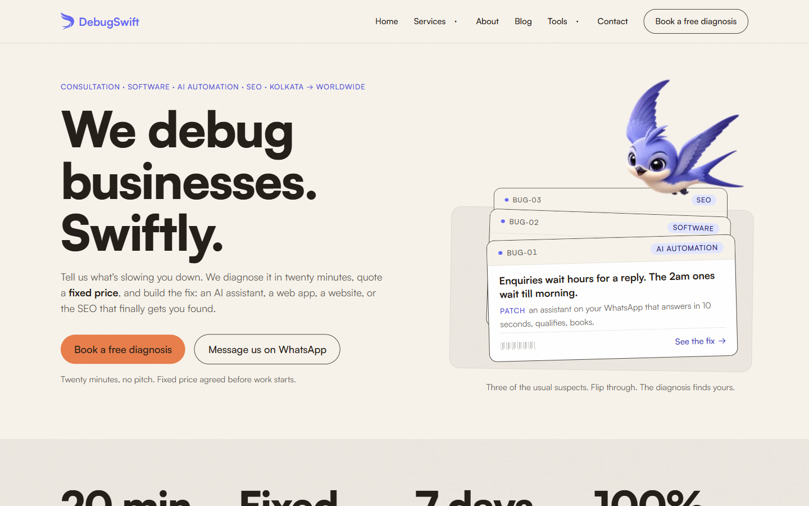

# DebugSwift

**Debugging businesses swiftly.**

**Live:** https://debugswift.com

The website of DebugSwift, a founder-led technology agency in Kolkata. We understand a business, find the problem costing it most, and fix it with technology.

## What we do

- **Consultation:** finding the real problem before anyone writes code
- **AI and automation:** assistants that answer and book, AI wired into the tools you already run, and manual steps automated
- **Software:** custom web apps, portals, dashboards and booking tools
- **Websites:** conversion websites, landing pages and e-commerce
- **SEO and local visibility:** showing up where customers search
- **Brand and design systems**

Each service has its own page at [debugswift.com/services](https://debugswift.com/services).

## Also on the site

- [Lead Engine](https://debugswift.com/lead-engine): our WhatsApp enquiry product ([public page](https://github.com/DebugSwiftHQ/lead-engine))
- [Free tools](https://debugswift.com/tools) ([public page](https://github.com/DebugSwiftHQ/tools))
- [DuctForge](https://ductforge.debugswift.com) ([public page](https://github.com/DebugSwiftHQ/ductforge))
- [Blog](https://debugswift.com/blog)

## How it's built

- **No cookies,** so no cookie banner.
- **No fake proof:** no invented testimonials, logos, statistics or team members.
- **Checked by machine, not by eye alone:** an automated pass walks every page at desktop and phone widths for contrast, layout overflow, heading order and metadata.
- **Text that doesn't jump:** the fallback font is measured to match the real one, so nothing re-wraps when it loads.

What changed, and when: [CHANGELOG.md](CHANGELOG.md)

## Found something broken?

[Report it here](../../issues/new/choose). A screenshot helps.

## Source code

The site's source is private. This repository is its public home.

**Contact:** hello@debugswift.com
